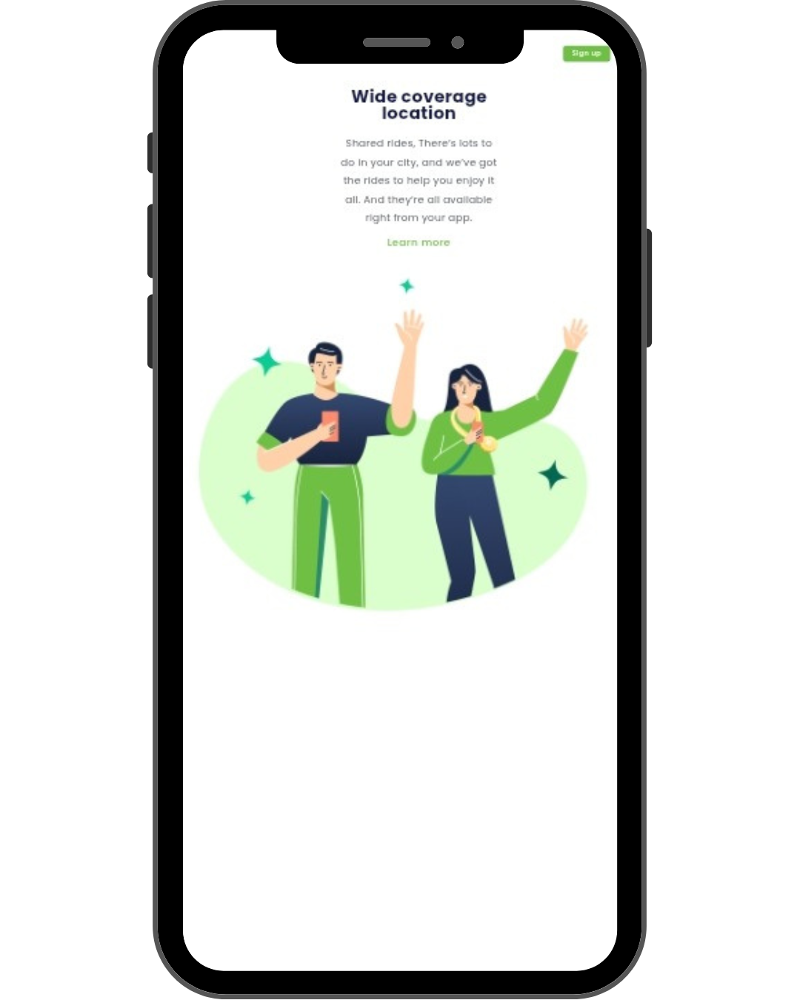

# Projeto: We Care

Este é um projeto de uma landing page desenvolvida em 
 e  durante o curso do <a href="https://rodolfomori.com.br/devclub">DevClub</a>.
 Neste projeto testei meu aprendizado sobre HTML, CSS e responsividade.

## 🚀 Tecnologias Utiizadas
- HTML5
- CSS3
- JavaScript
- Git & GitHub

## 🎯 Layout do projeto

  
  

## ✅ Projeto finalizado

## 🧑‍💻 Desenvolvido por

Hudson Júnior  
 • 
